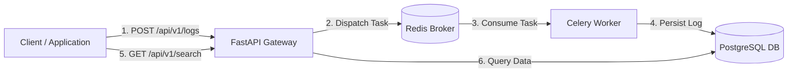

# 🚀 Distributed Log Engine


A high-performance, asynchronous log ingestion and search system engineered with **FastAPI**, **Celery**, **Redis**, and **PostgreSQL**. Built to handle decoupled task processing and fast log indexing in containerized environments.

---

## 🏗️ Architecture & Data Flow



* **FastAPI**: Handles HTTP endpoints for ingesting, querying, and searching logs.
* **Celery**: Processes log ingestion tasks asynchronously.
* **Redis**: Acts as the message broker for Celery task queues.
* **PostgreSQL**: Persists structured log data with UUID primary keys.
* **Docker Compose**: Orchestrates all services into containerized environments.

---

## Quick Start

### 1. Run the Application

Start all services in detached mode:
```bash
docker compose up -d --build
```

### 2. Verify System Health

Check that all containers are active:
```bash
docker compose ps
```

The API will be available at `http://localhost:8000`. You can also explore the interactive API docs at `http://localhost:8000/docs`.

### 3. API Usage Examples

**Ingest a Log (Asynchronous)**
```powershell
Invoke-RestMethod -Uri "http://localhost:8000/api/v1/logs" -Method Post -ContentType "application/json" -Body '{"message": "System test", "level": "INFO"}'
```

**Search Logs**
```powershell
Invoke-RestMethod -Uri "http://localhost:8000/api/v1/search?q=System" -Method Get
```

### 4. Shutdown

To stop and remove containers:
```bash
docker compose down
```
